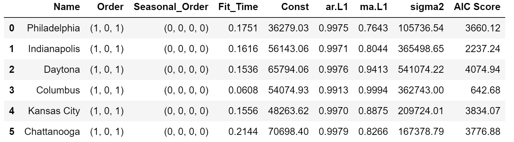
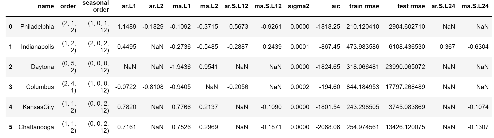
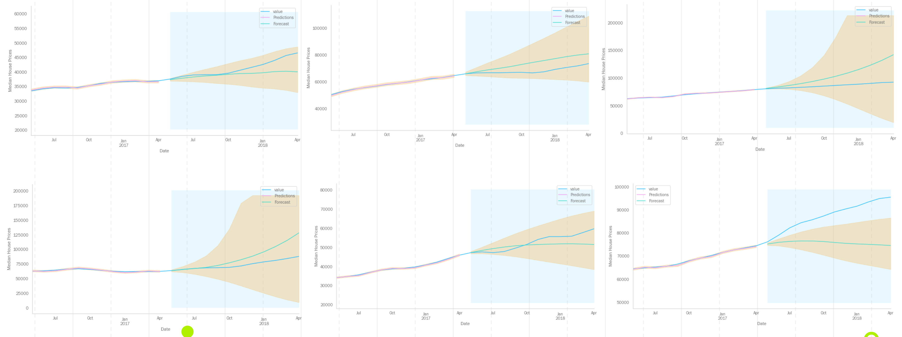
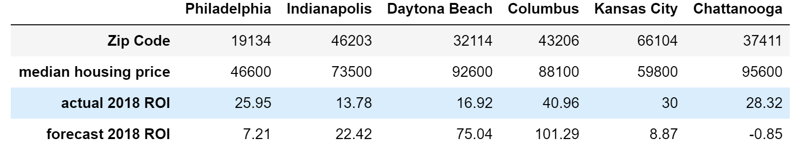

# Grocery Recommendation on InstaCart Data

# UNDER CONSTRUCTION

Flatiron Data Science Project - Capstone
 
         
<!---Photo by Kevork Kurdoghlian on Unsplash--->       
<!---Photo by <a href="https://unsplash.com/@pedroplus?utm_source=unsplash&amp;utm_medium=referral&amp;utm_content=creditCopyText">Pedro da Silva</a> on <a href="https://unsplash.com/s/photos/stop-sign?utm_source=unsplash&amp;utm_medium=referral&amp;utm_content=creditCopyText">Unsplash</a>--->
Prepared and Presented by:  **_Melody Peterson_**  
[Presentation PDF](https://github.com/melodygr/dsc-phase-4-project/blob/main/Zillow_Presentation.pdf "Presentation PDF")

### Business Problem    
For this analysis I will be working as a Data Scientist for a grocery store that is looking to discover insights from sales data that could be used for targeted direct mail marketing (specific coupons mailed to customers), targeted email marketing ("An item you like has gone on sale!"), and online shopper recommendations to 'add to cart' based on similar items and also based on items other people who bought that item have purchased.  
 
If time permits, I may also perform a market basket analysis to forecast what products a customer is likely to purchase in their next order.  

Skills demonstrated:  
1. SQL table creation
1. Data Clustering on users  
2. Recommendation systems  
* Content-based filtering  
* Collaborative filtering  
3. Market Basket analysis  
4. Website interface  
  
### Data    
This data was retrieved from [Kaggle](https://www.kaggle.com/psparks/instacart-market-basket-analysis) and was provided by Instacart for a market basket analysis competition in 2018.  
 
The data is divided into 6 files:  
 
**Aisles.csv**: 134 Unique aisle numbers and descriptions  
**Departments.csv**: 21 Unique department numbers and descriptions  
**Products.csv**: 49,688 Unique product ids, with description, aisle id, and department id  
**Orders.csv**: 3,421,083 Unique order id, with user id, order number, order_dow, order_hour_of_day, days_since_prior_order, and eval_set indicating if the order is in train, prior, or test  
**Order_products__train.csv**: Order id, product id, add to cart order, and reorder indicator  
**Order_products__prior.csv**: Order id, product id, add to cart order, and reorder indicator  
  
 

### Modeling Process
Starting with the initial data cleaning/scrubbing phase, it was discovered that many zip codes did not have the full date range of data.  Some zip codes had data only going back to 06-2014.  I chose not to eliminate any zip codes for missing values but would model on the data available.  My next step was to calculate an ROI for each zip code that I could compare across all of the data, so for instance a 10 year ROI would not be possible.  Since my business case was for short term investment opportunities, a 10 year ROI would not be necessary.  I calculated a 4 year ROI and the most recent year (2018) ROI.  Finally I calculated the average one year ROI over the past 3 years and chose to use that as my comparison metric.  

Per my business problem, I was looking for the best ROI for small investors so I graphed ROI against the current Median Housing Price and then subset to the lower housing prices, eventually selecting six zip codes with high average ROI and low median housing prices for further analysis.  

Here is a comparison of the data on the 6 zip codes over time.  As you can see, Indianapolis and Columbus have limited data.  But generally they all reflect the housing market crash of 2009 and then these six zipcodes have shown significant increases over the past 4 years.

This graph of the Philadelphia data shows how each time series can be broken out into trend, seasonality, and noise components.  

Initial ARMA (Auto-regressive Moving Average) models were run on all 6 zip codes to establish a baseline for future models, and then several models were run and parameters tuned to find the model with the least error.
   
   
 
   
   
Final Seasonal ARIMA model parameters  
   
   
            
   

### Model Predictions  
   
 
   
   

### Model ROI Comparison  
   
   
  
  

### Conclusions  

* All training data far outperformed the test data, indicating some overfitting.
* The models are all very skewed because of the market crash in 2009.
* Columbus and Daytona had very large confidence intervals and overly high forecasts.
* Chattanooga has outperformed even the confidence intervals of the model.
* Philadelphia is potentially a good 50K investment , Indianapolis at 75K and Chattanooga at 100K investment
  
### Caveats:  
  
* Logged and differenced the data but some still did not test as stationary according to the Dickey Fuller test.
* Real estate predictions can vary due to unseen fluctuations in the market  
  
### Next Steps / Future Work  
  
* Obtain current data after 2018 for current predictions. Found zip code data on Redfin but it is rolling avg by zip code.
* Investigate why some of the models seem so far off in their forecasts.
* Try Facebook Prophet with each of the chosen zip codes
* Try other methods of choosing zip codes, including clustering to find trends
* Look for exogenous data to add to the model

