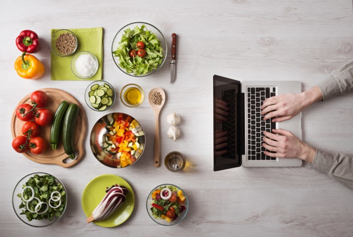
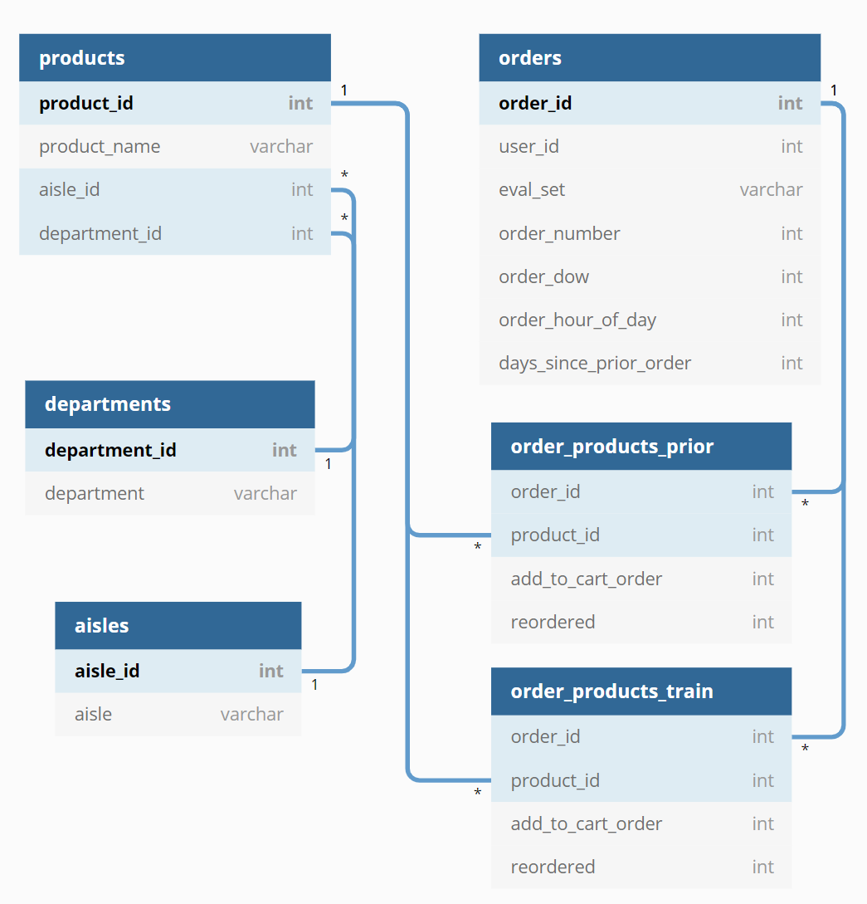
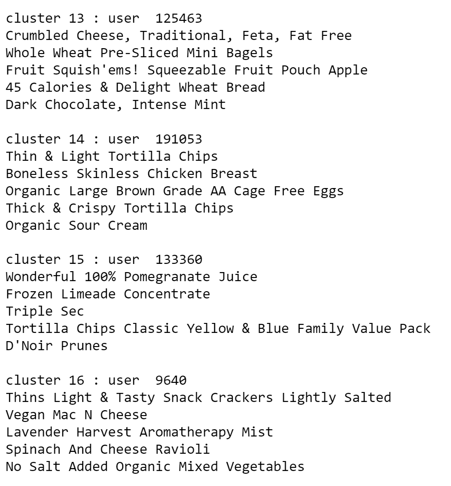

# Grocery Recommendation on Instacart Data  

Flatiron Data Science Project - Capstone
 
         
<!---Photo by Kevork Kurdoghlian on Unsplash--->       
<!---Photo by <a href="https://unsplash.com/@pedroplus?utm_source=unsplash&amp;utm_medium=referral&amp;utm_content=creditCopyText">Pedro da Silva</a> on <a href="https://unsplash.com/s/photos/stop-sign?utm_source=unsplash&amp;utm_medium=referral&amp;utm_content=creditCopyText">Unsplash</a>--->
Prepared and Presented by:  **_Melody Peterson_**   
[Presentation PDF](https://github.com/melodygr/capstone_recommendation/blob/main/Grocery%20MVP.pdf "Presentation PDF")  
[Blog Post](https://medium.com/codex/creating-a-multifaceted-grocery-recommender-system-c394208f5e0b "Medium Blog Post")  

### Business Problem    
For this analysis I will be working as a Data Scientist for a grocery store that is looking to discover insights from sales data that could be used for targeted direct mail marketing (specific coupons mailed to customers), targeted email marketing ("An item you like has gone on sale!"), and online shopper recommendations to 'add to cart' based on similar items and also based on items other people who bought that item have purchased.  
 

### Skills demonstrated:  

1. Data Clustering on users  
2. Recommendation systems - Content-based filtering and Collaborative filtering 
3. NLP product search engine   
5. Market Basket analysis  
6. FLASK Website interface 
 
  
### Data    
This data was retrieved from [Kaggle](https://www.kaggle.com/psparks/instacart-market-basket-analysis) and was provided by Instacart for a market basket analysis competition in 2018.  
 
The data is divided into 6 files:  
 
**Aisles.csv**: 134 Unique aisle numbers and descriptions  
**Departments.csv**: 21 Unique department numbers and descriptions  
**Products.csv**: 49,688 Unique product ids, with description, aisle id, and department id  
**Orders.csv**: 3,421,083 Unique order id, with user id, order number, order_dow, order_hour_of_day, days_since_prior_order, and eval_set indicating if the order is in train, prior, or test  
**Order_products__train.csv**: Order id, product id, add to cart order, and reorder indicator  
**Order_products__prior.csv**: Order id, product id, add to cart order, and reorder indicator  
  
 

### Modeling Process  

#### Exploratory Data Analysis  
[View the EDA notebook](https://github.com/melodygr/capstone_recommendation/blob/main/Capstone_Project.ipynb "Capstone Notebook")  

Useful information can be derived from just exploring the purchasing patterns in the data.  We can see which aisles and departments are ordered from the most and even down to the product level.  We can see the typical number of items in each order and how many days users go before their next order.  As an example, the most ordered departments can be seen below.  

  

#### Clustering  
[View the Clustering notebook](https://github.com/melodygr/capstone_recommendation/blob/main/Clustering_and_NLP.ipynb "Clustering Notebook")  

After EDA and merging of the tables together, my first step was to cluster the users using a KMeans unsupervised clustering.  The clustering took into account how many purchases each user made from each aisle, as well as information such as number of days between orders and total number of orders placed.  As I added more clusters, the results continued to improve with more and more well-defined and separate clusters.  In the interest of practicality, however, I felt that more than 20 separate clusters of users began to be less feasible to separately market to each one.    

For visualizing the clusters I used t-SNE dimensionality reduction to give each cluster only 3 attributes, lending itself to a 3D model as seen below using Matplotlib.  I also made this graph using Plotly for more interactivity if used in a dashboard for analysis.  

  

This heatmap also shows the differences in the clusters, particularly which grocery aisles are most purchased by each cluster.  

   

I also felt it would be important to analyze the buying power of each cluster, as measured by orders per users, products per user, and percentage of users in each cluster.  Sorting these statistics different ways shows interesting results depending on what you are looking for. We can see that cluster 8 orders a very large number of products per user, but overall cluster 8 represents a small portion of all of the users. Cluster 12 represents over 50% of all of the users, but only 25% of the orders and only 17% of the products.  

#### NLP Search engine  
[View the NLP notebook](https://github.com/melodygr/capstone_recommendation/blob/main/Clustering_and_NLP.ipynb "NLP Notebook")  

Next I chose to generate recommendations for a user based on the product name, aisle, and department.  This would basically function as a search engine so the user could enter any text data and products most similar to that text would be displayed.  I stemmed the text data (basically removing suffixes) and used a count vectorizer to generate numerical representations of the words.  Then when a search is entered, the search goes through the same stemming and vectorizing and is compared to the existing product base using cosine similarity (a measure of the size of the angle generated between the word vectors.)  

#### Simple Python RecommendatIon System Engine (surprise)  
[View the Recommendation notebook](https://github.com/melodygr/capstone_recommendation/blob/main/Capstone_Project.ipynb "Recommendation Notebook")  

Due to the size of my dataset, it was not possible to generate a "memory-based" recommendation system, which uses similarity measures to match similar products or users together.  Instead, I created a "model-based" recommendation system using Singular Value Decomposition (SVD) that will generate predictions of a user's rating of an item that they have not previously ordered.  As opposed to a movie recommender based on users actual ratings of each movie, I chose to use the number of times a user has purchased an item as a stand in for an actual rating.  This generated a rating scale of 1 - 100 for each user and product combination.  The model showed promising results with an avarage error of only 3.46.  However, upon further inspection, the products with high purchase rates and therefore high ratings were not being predicted as accurately as the lower rated items simply because there are so few of them, like a large class imbalance.  So I instead changed to rating scale to 1 - 5 by simply setting any rating of 5 or higher equal to 5.  The average error on the new model, after performing a grid search for the best parameters, was reduced to only 1.26.

Upon generating the top recommendations for each user, I discovered a large popularity bias in the recommendations.  Items that had been ordered frequently and by many users, like the top product of bananas, were being recommended to most users.  After researching ways to deal with popularity bias, [like this paper on Binary and Smooth xQuAD](https://www.researchgate.net/publication/330543775_Managing_Popularity_Bias_in_Recommender_Systems_with_Personalized_Re-ranking), I decided to a create personalized re-ranking of recommended products for each user. 

This graph conveys the idea of a short head versus long tail in my product data.

I created a function that would generate predicted ratings for each user based on the SVD model.  Then, before generating the output of the user ratings, the function takes in a specified weighting parameter for how many items should be generated from the short head of products or the rest of the products.  I defined the short head as the top 6200 (out of 45000) products which accounted for 80% of the purchases.  Generating the recommendations this way, allows the store to decide how diverse the ratings should be to encourage a diversity of recommendation, yet also keeps the ratings in the order they were predicted by the model and specific to each user.

I also created a function to allow a new user to generate product recommendations by providing a specified number of ratings on sample products, and then rerunning the SVD to generate a list of predictions based on those rankings.  This function allows the user to optionally choose which aisle to rate products from, and which aisle to provide recommendations for, as well as taking in the diversification parameter as described above.  

### Market Basket Analysis

Association rules indicate a strong relationship between items that customers purchased in the same transaction.   
  
**Frequency**: Probability of buying a product or pair of products  
**Support**: Probability of buying X and Y products together:  Support(X, Y) = Freq(X,Y)/N  
**Confidence**: This says how likely item Y is purchased when item X is purchased.   Confidence(X, Y) = Freq(X,Y) / Freq(X)  
**Lift**: Shows how likely item Y is purchased when item X is purchased, while controlling for how popular they are.  
Lift = Support (X, Y) / ( Support(X) * Support(Y) )  

Using association rules derived from these probablities for each product pair ordered for each cluster, I can generate recommendations for new products based on a single product purchased or 'added to cart'.

This chart shows the association rules for Cluster 19 at a product level.  You can see that the product pairs with high lift seem likely to be purchased together, such as the two different condensed soups.  But products with very low lift are unlikely to be purchased together.

  

This chart shows the association rules at an aisle level, showing the likelihood of buying from aisle B if you are making a purchase from aisle A.  

  

Finally, this output shows what products are recommended to each cluster if they are purchasing "Mild Salsa Roja".  

 

### FLASK app  
[View the FLASK app](https://github.com/melodygr/grocery_recommendation/tree/main/flask_app "FLASK app")  
  
I have begun the development of a FLASK app to generate grocery recommendations through a website.  It currently has four pages: the index, nlp recommender, ratings and svd recommender.  However, more work needs to be done on the functionality of the pages and their ability to return the recommendations.  The NLP recommender is up-to-date but the SVD recommender takes a long time to run because it fits and predicts a whole new model based on the user's input.  If I can find a cluster for the new user, that should shorten the run time considerably.  I also intend to add a page for the market basket analysis that will suggest products based on the association rules for each cluster.  More to follow.

### Conclusions  
* Cluster data is well-suited for market segmentation and targeted marketing
* It is important to look at the buying power of each cluster to determine how much effort to put into targeting
* The NLP search engine would be a useful tool for online shopping recommendations
* The SVD model created much better predictions when we lowered the rating scale of the products to 1-5
* Popularity bias skewed the SVD model but it can be controlled by personalized re-ranking of the recommendation

  
### Next Steps / Future Work  
  
* Cluster again allowing more than 20 clusters to make some of the big clusters smaller?
* Create a dashboard using DASH for graphical representation of the clusters  
* Generate word embeddings for the search engine for more specific search results
* Calculate and visualize error on the surprise model
* Create SQL tables of the data and load onto AWS
* Add association rules to FLASK app
* Use Heroku to push local FLASK app to the web

